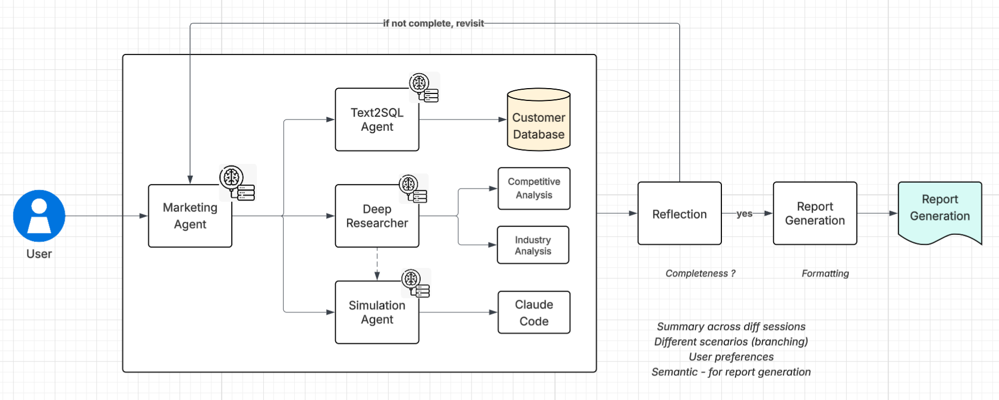

# Marketing Agent - Multi-Agent Marketing Research and Analysis System

## Overview

The Marketing Agent is a comprehensive multi-agent system designed to automate marketing research, data analysis, and report generation. Built with Amazon Bedrock AgentCore and the Strands Agents SDK, this system leverages specialized AI agents that collaborate to conduct market research, analyze customer data, generate insights, and produce professional marketing reports. The system integrates memory capabilities for personalized experiences and maintains context across sessions.

<div align="center">

</div>

🎯 The Marketing Agent empowers marketing teams to:

- Conduct comprehensive market research through web search and data analysis
- Analyze customer databases and generate actionable insights
- Create professional marketing reports with data visualizations
- Maintain conversation history and user preferences through memory integration
- Execute complex marketing workflows through intelligent task planning

✨ Key capabilities include:

- **Multi-Agent Orchestration**: Specialized agents for research, analysis, reporting, and reflection
- **Memory Integration**: Persistent user preferences and marketing knowledge using Mem0
- **Web Research**: Real-time market research using Tavily search capabilities
- **Data Analysis**: SQL-based customer database analysis and Python-powered analytics
- **Report Generation**: Automated creation of professional marketing reports
- **Quality Assurance**: Built-in reflection and retry mechanisms for high-quality outputs

### Use case details

| Information | Details |
|-------------|---------|
| Use case type | Conversational |
| Agent type | Multi-agent |
| Use case components | Tools, Memory, AgentCore Runtime |
| Use case vertical | Marketing/Business Intelligence |
| Example complexity | Advanced |
| SDK used | Amazon Bedrock AgentCore SDK, Strands Agents SDK, Mem0 |

## Solution Architecture

The Marketing Agent system consists of several specialized agents working together:


### Agent Roles

1. **Planner Agent**: Orchestrates the workflow and creates execution plans
2. **Researcher Agent**: Conducts web research and gathers market intelligence
3. **Text2SQL Agent**: Analyzes customer databases and generates SQL insights
4. **Python Agent**: Performs data analysis and creates visualizations
5. **Report Agent**: Generates professional marketing reports and documentation
6. **Memory Agent**: Manages user preferences and conversation context
7. **Reflection Agent**: Ensures quality and provides feedback for improvements

### Key Features

- **Intelligent Task Planning**: Dynamic workflow generation based on user requests
- **Parallel Execution**: Multiple agents can work simultaneously for efficiency
- **Memory Integration**: Persistent storage of user preferences and marketing insights
- **Quality Assurance**: Built-in reflection and retry mechanisms
- **Professional Reporting**: Automated generation of marketing reports with visualizations
- **AgentCore Runtime**: Production-ready deployment with Amazon Bedrock AgentCore

## Prerequisites

| Requirement | Description |
|-------------|-------------|
| Python 3.10+ | Python runtime environment |
| AWS Account | With appropriate permissions for Bedrock and AgentCore |
| Tavily API Key | For web search capabilities |
| Amazon Bedrock Access | For Claude 3.5 Sonnet model access |
| SQLite Database | Customer data storage (included) |

### Required Environment Variables

Create a `.env` file in the project root:

```bash
# AWS Configuration
AWS_REGION=us-west-2
AWS_PROFILE=default

# Bedrock Configuration
BEDROCK_MODEL_ID=anthropic.claude-3-5-sonnet-20241022-v2:0

# Tavily API (for web search)
TAVILY_API_KEY=your_tavily_api_key_here

# Memory Configuration (Mem0)
MEM0_API_KEY=your_mem0_api_key_here  # Optional: for hosted Mem0
OPENAI_API_KEY=your_openai_api_key_here  # For embeddings

# Database Configuration
SQLITE_DATABASE_PATH=./data/customers.db

# Knowledge Base (Optional)
KNOWLEDGE_BASE_ID=your_knowledge_base_id  # Optional: for schema retrieval

# Output Configuration
OUTPUT_DIR=./output
```

## Installation and Setup

### 1. Clone and Install Dependencies

```bash
# Navigate to the marketing agent directory
cd 02-use-cases/marketing-agent

# Create virtual environment
python -m venv venv
source venv/bin/activate  # On Windows: venv\Scripts\activate

# Install dependencies
pip install -r requirements.txt
```

### 2. Configure Environment

```bash
# Copy environment template
cp .env.example .env

# Edit .env file with your API keys and configuration
nano .env
```

### 3. Database Setup

The system includes a pre-configured SQLite database with sample customer data. The database contains:

- **customers**: Customer demographic information
- **recent_purchases**: Purchase history and behavior data

### 4. AgentCore Runtime Deployment (Optional)

For production deployment using Amazon Bedrock AgentCore:

```bash
# Configure IAM role
python iam.py

# Deploy to AgentCore Runtime
# This will create the necessary IAM roles and deploy the agent
```

## Usage Instructions

### 1. Local Development

Run the marketing agent locally for development and testing:

```bash
python main.py
```

### 2. Interactive Usage

The system supports natural language queries for various marketing tasks:

#### Market Research Examples:
- "Research the latest trends in sustainable fashion for 2024"
- "Analyze competitor pricing strategies in the SaaS market"
- "Find emerging social media platforms popular with Gen Z"

#### Customer Analysis Examples:
- "Analyze our customer demographics and purchasing patterns"
- "Identify our top customer segments by revenue"
- "Show me seasonal trends in customer behavior"

#### Report Generation Examples:
- "Create a comprehensive market analysis report for Q4 2024"
- "Generate a customer segmentation report with recommendations"
- "Prepare a competitive analysis report for our product launch"

### 3. Memory and Personalization

The system remembers:
- User preferences for report formats
- Company-specific information and context
- Previous research topics and insights
- Preferred analysis methods and metrics

### 4. AgentCore Runtime Deployment

For production deployment:

```bash
# Deploy using the provided configuration
python iam.py

# The system will be available at the AgentCore endpoint
# Use the provided agent ARN for integration
```

## System Components

### Core Files

- `main.py`: Main application entry point and orchestration
- `config.py`: Configuration management and agent setup
- `constants.py`: System constants and model configurations
- `utils.py`: Utility functions for AgentCore deployment

### Agent Implementations

- `agents/planner_agent.py`: Task planning and workflow orchestration
- `agents/researcher_agent.py`: Web research and market intelligence
- `agents/text2sql_agent.py`: Database analysis and SQL generation
- `agents/python_agent.py`: Data analysis and visualization
- `agents/report_agent.py`: Professional report generation
- `agents/memory_agent.py`: Memory management and personalization
- `agents/reflection_agent.py`: Quality assurance and feedback

### Tools and Utilities

- `tools/tavily_tool.py`: Web search and research capabilities
- `tools/sqllite_tool.py`: Database query execution
- `tools/knowledge_base_tool.py`: Schema and metadata retrieval

### Data and Configuration

- `data/customers.db`: Sample customer database
- `.bedrock_agentcore.yaml`: AgentCore runtime configuration
- `Dockerfile`: Container configuration for deployment

## Advanced Features

### 1. Multi-Agent Workflow

The system uses intelligent task planning to:
- Break down complex requests into manageable tasks
- Assign tasks to appropriate specialized agents
- Execute tasks in parallel when possible
- Maintain dependencies between related tasks

### 2. Memory Integration

Using Mem0 for persistent memory:
- User preferences and company context
- Previous research findings and insights
- Conversation history and context
- Personalized report templates

### 3. Quality Assurance

Built-in reflection mechanisms:
- Automatic quality assessment of outputs
- Retry logic for improved results
- Feedback integration for continuous improvement

### 4. Professional Reporting

Automated report generation with:
- Executive summaries and key insights
- Data visualizations and charts
- Actionable recommendations
- Professional formatting and structure

## Troubleshooting

### Common Issues

1. **API Key Errors**: Ensure all required API keys are properly configured in `.env`
2. **Database Access**: Verify SQLite database path and permissions
3. **Memory Issues**: Check Mem0 configuration and OpenAI API key for embeddings
4. **AgentCore Deployment**: Verify AWS permissions and IAM role configuration

### Debug Mode

Enable detailed logging:

```bash
# Set debug level in main.py
import logging
logging.basicConfig(level=logging.DEBUG)
```

## Clean Up Instructions

### Local Resources

```bash
# Remove virtual environment
deactivate
rm -rf venv

# Clean output files
rm -rf output/
```

### AgentCore Resources

```bash
# Delete AgentCore runtime (if deployed)
aws bedrock-agentcore delete-runtime --agent-id <your-agent-id>

# Remove IAM roles (if created)
aws iam delete-role --role-name agentcore-agentcore_strands-role
```

## Security Considerations

- Store API keys securely using environment variables
- Implement proper IAM permissions for AWS resources
- Use Amazon Bedrock Guardrails for content filtering
- Validate and sanitize all user inputs
- Monitor agent interactions and outputs

## License

This project is licensed under the Apache-2.0 License. See the [LICENSE](LICENSE) file for details.

## Contributing

Contributions are welcome! Please read the contributing guidelines and submit pull requests for any improvements.

## Disclaimer

This sample application is for demonstration purposes and is not production-ready. Please validate the code with your organization's security best practices before deploying to production environments.